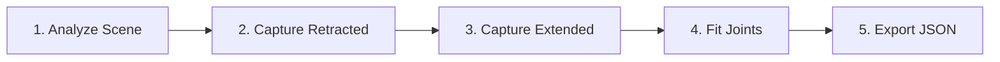

# Auto Kinematic Tooling System - Complete Guide

**Version:** 2.0 (Corrected Workflow)
**Last Updated:** 2025-10-30
**Owner:** George (Claude Code Agent 1)

---

## Table of Contents

1. [Overview](#overview)
2. [System Architecture](#system-architecture)
3. [Workflow Summary](#workflow-summary)
4. [Step-by-Step User Guide](#step-by-step-user-guide)
5. [Technical Deep Dive](#technical-deep-dive)
6. [API Reference](#api-reference)
7. [Troubleshooting](#troubleshooting)

---

## Overview

The Auto Kinematic Tooling System automatically generates kinematic models from 3D scene geometry **without requiring manual tooling JSON files**. This is a critical correction from earlier documentation.

### What It Does

**CORRECT WORKFLOW:**
```
GLB File → Geometric Analysis → State Capture → ICP Alignment → JSON Generation → Animation
```

**WRONG (Previous Assumption):**
```
GLB File + Tooling JSON → Parse → Animate  ❌ INCORRECT
```

### Key Features

- **Geometric Detection:** No dependency on naming conventions or manual tags
- **ICP-Based Joint Fitting:** Automatically infers joint type, axis, and limits
- **Point Cloud Analysis:** Handles non-identical geometries (moving part ≠ fixed part)
- **Interactive UI:** Step-by-step workflow with visual feedback
- **JSON Export:** Generates tooling JSON as **output**, not input

---

## System Architecture

### Component Overview

```
┌─────────────────────────────────────────────────────────────┐
│                     User Workflow                          │
├─────────────────────────────────────────────────────────────┤
│  1. Load GLB → 2. Analyze → 3. Capture → 4. Fit → 5. Export │
└─────────────────────────────────────────────────────────────┘
                             ↓
┌─────────────────────────────────────────────────────────────┐
│              KinematicExtractionPipeline                   │
│  (Orchestrates the complete workflow)                      │
└─────────────────────────────────────────────────────────────┘
         ↓              ↓              ↓              ↓
┌────────────────┐ ┌──────────┐ ┌──────────┐ ┌──────────────┐
│ Geometric      │ │  State   │ │   ICP    │ │    Joint     │
│ ToolAnalyzer   │ │ Capture  │ │ Aligner  │ │  Extractor   │
│ (NEW)          │ │          │ │          │ │  (NEW)       │
└────────────────┘ └──────────┘ └──────────┘ └──────────────┘
         ↓
┌────────────────────────────────────────────────────────────┐
│              Tooling JSON (OUTPUT)                         │
│  { joints: [...], actuatorProgram: {...} }                 │
└────────────────────────────────────────────────────────────┘
```

### New Components (This Refactoring)

1. **GeometricToolAnalyzer** (`src/babylon/sceneAnalysis/GeometricToolAnalyzer.ts`)
   - Replaces string-based detection
   - Uses volume, proximity, connectivity for classification
   - Handles geometric duplicates (fixed/moving pairs)

2. **JointExtractor** (`src/babylon/pointCloud/JointExtractor.ts`)
   - Converts ICP transforms to joint definitions
   - Infers joint type (hinge vs prismatic)
   - Extracts axis, anchor, limits

3. **KinematicExtractionPipeline** (`src/babylon/pipeline/KinematicExtractionPipeline.ts`)
   - Orchestrates complete workflow
   - Manages state between steps
   - Provides step-by-step and batch APIs

4. **KinematicExtractionPanel** (`src/ui/components/KinematicExtractionPanel.tsx`)
   - Interactive UI for workflow
   - Visual step indicators
   - Export controls

### Existing Components (Integrated)

1. **StateCapture** - Samples point clouds from scene nodes
2. **ICP** - Aligns point clouds to compute transform
3. **ValveBank** - Executes actuator programs
4. **ToolingJsonAdapter** - Parses legacy tooling JSON format

---

## Workflow Summary

### The 5-Step Process



**Step 1: Analyze Scene**
- Input: Loaded GLB file
- Process: Geometric analysis (clustering, volume, connectivity)
- Output: ToolGraph with fixed/moving units identified

**Step 2: Capture Retracted State**
- Input: User positions moving parts in home position
- Process: Sample mesh vertices to build point cloud
- Output: Retracted state snapshot (points + transforms)

**Step 3: Capture Extended State**
- Input: User positions moving parts in actuated position
- Process: Sample mesh vertices to build point cloud
- Output: Extended state snapshot (points + transforms)

**Step 4: Fit Joints**
- Input: Retracted + extended point clouds
- Process: ICP alignment → transform decomposition → joint inference
- Output: Joint definitions (type, axis, anchor, limits)

**Step 5: Export JSON**
- Input: All joint definitions
- Process: Bundle joints + actuator program
- Output: `kinematic_model.json` (downloadable)

---

## Step-by-Step User Guide

### Prerequisites

1. GLB file loaded in kinetiCORE
2. Scene contains tooling with both fixed and moving parts
3. Moving parts can be manually positioned (or already in both states)

### Using the UI (Recommended)

#### 1. Open Kinematic Extraction Panel

```typescript
// In kinetiCORE UI
// TODO: Add menu item to open panel
```

#### 2. Analyze Scene

1. Click **"Analyze Scene"** button
2. System performs geometric analysis
3. Results show:
   - Total units found
   - Fixed units count
   - Moving units count
4. First moving unit is auto-selected

**What Happens Behind the Scenes:**
```typescript
const analyzer = new GeometricToolAnalyzer();
const toolGraph = analyzer.analyze(scene, {
  clusteringDistance: 0.05,      // 5cm clustering radius
  similarityThreshold: 0.85,     // 85% geometric match
  fixedProximityThreshold: 0.5,  // 50cm from origin = likely fixed
  fixedConnectivityThreshold: 3  // 3+ children = likely fixed
});
```

**Geometric Heuristics:**
- Large volume + near origin = **fixed base**
- High connectivity (many children) = **fixed infrastructure**
- Small, isolated clusters = **moving parts**
- Elongated bounding box = **slide mechanism**
- Geometric duplicates = **fixed/moving pair**

#### 3. Capture Retracted State

1. **Manually position** selected unit in home (retracted) position
2. Click **"Capture Retracted"** button
3. System samples mesh vertices (default: every 10th vertex, max 1000 points)
4. Results show point count captured

**Manual Positioning:**
- Use transform gizmos to move parts
- Or import scene with parts already in retracted position
- Ensure parts are in typical "home" or "resting" state

#### 4. Capture Extended State

1. **Manually position** selected unit in actuated (extended) position
2. Click **"Capture Extended"** button
3. System samples mesh vertices
4. Results show point count captured

**Manual Positioning:**
- Move parts to fully actuated position
- For clamps: closed position
- For pins: extended position
- For slides: maximum travel

#### 5. Fit Joints

1. Click **"Fit Joints"** button
2. System runs ICP alignment between retracted/extended states
3. Joint type, axis, and limits are automatically inferred
4. Results show:
   - Joint count fitted
   - Confidence scores
   - Residual errors

**Joint Inference Logic:**
- Translation > 1mm → **Prismatic joint**
- Rotation > 2.86° → **Hinge joint**
- Both present → Choose dominant motion
- Axis extracted from transform
- Limits estimated from magnitude

#### 6. Export JSON

1. Click **"Export JSON"** button
2. System bundles all joints + actuator program
3. Click **"Download kinematic_model.json"**
4. File saved to downloads folder

**JSON Format:**
```json
{
  "joints": [
    {
      "id": "gripper_jaw_joint",
      "type": "hinge",
      "parentId": "gripper_base",
      "childId": "gripper_jaw",
      "axisWorld": { "x": 0, "y": 1, "z": 0 },
      "anchorWorld": { "x": 0.1, "y": 0, "z": 0.05 },
      "limits": { "lower": 0, "upper": 0.785 }
    }
  ],
  "actuatorProgram": {
    "channels": [
      {
        "id": "ch1",
        "unitId": "gripper_jaw",
        "timeline": [
          { "tMs": 0, "cmd": "retract" },
          { "tMs": 1000, "cmd": "extend" },
          { "tMs": 2000, "cmd": "retract" }
        ]
      }
    ],
    "residuals": {
      "gripper_jaw": 0.0023
    }
  }
}
```

---

### Using the API (Advanced)

For programmatic or batch processing:

```typescript
import { KinematicExtractionPipeline } from './babylon/pipeline/KinematicExtractionPipeline';

const scene = /* your Babylon scene */;
const pipeline = new KinematicExtractionPipeline(scene);

// Step 1: Analyze
const toolGraph = await pipeline.analyzeScene({
  clusteringDistance: 0.1,
  similarityThreshold: 0.8
});

console.log(`Found ${toolGraph.units.length} units`);

// Step 2 & 3: Capture states (manual positioning required between calls)
const movingUnit = toolGraph.units.find(u => !u.isFixed);

// User positions parts in retracted state...
await pipeline.captureUnitState(movingUnit.id, 'retract');

// User positions parts in extended state...
await pipeline.captureUnitState(movingUnit.id, 'advance');

// Step 4: Fit joints
await pipeline.fitJoints({
  minConfidence: 0.5,
  limitSafetyFactor: 1.1
});

// Step 5: Export
const model = pipeline.exportToJSON();
console.log(JSON.stringify(model, null, 2));
```

---

## Technical Deep Dive

### Geometric Tool Analysis

**Problem with String Matching (Old Approach):**
```typescript
// ❌ UNRELIABLE
const isFixed = node.name.toLowerCase().includes('fixture');
const isMoving = node.name.toLowerCase().includes('gripper');
```

**Solution: Geometric Properties (New Approach):**
```typescript
// ✅ ROBUST
const volume = computeVolume(node.boundingBox);
const proximity = node.centroid.length();
const connectivity = node.children.length;

if (volume > threshold && proximity < 0.5 && connectivity >= 3) {
  return 'fixed';
}
```

**Geometric Features Used:**

1. **Bounding Box Volume**
   - Large volume = likely fixed infrastructure
   - Small volume = likely moving actuator

2. **Proximity to Origin**
   - Near world origin = likely fixed base
   - Far from origin = likely end effector

3. **Connectivity (Child Count)**
   - Highly connected = structural component
   - Isolated = independent actuator

4. **Bounding Box Shape**
   - Cube/sphere = general component
   - Elongated (1 dimension >> others) = linear slide

5. **Geometric Similarity**
   - Match volume, surface area, shape
   - Identify duplicate geometries (fixed/moving pairs)

### ICP-Based Joint Fitting

**Algorithm:**

1. **Point Cloud Alignment**
   ```
   Input: P_retracted (N points), P_extended (N points)
   Output: Transform T that aligns P_retracted → P_extended

   for iter = 1 to maxIterations:
     P_transformed = T * P_retracted
     correspondences = findNearestNeighbors(P_transformed, P_extended)
     T_delta = computeRigidTransform(correspondences)
     T = T_delta * T
     if converged: break
   ```

2. **Transform Decomposition**
   ```
   T = [R | t]  (4x4 matrix)

   translation = [t_x, t_y, t_z]
   rotation_quaternion = extractQuaternion(R)
   rotation_axis, rotation_angle = quaternionToAxisAngle(rotation_quaternion)
   ```

3. **Joint Type Inference**
   ```
   if |translation| > threshold_translation:
     if |rotation_angle| < threshold_rotation:
       joint_type = PRISMATIC
       joint_axis = normalize(translation)
       joint_magnitude = |translation|

   else if |rotation_angle| > threshold_rotation:
     if |translation| < threshold_translation:
       joint_type = HINGE
       joint_axis = rotation_axis
       joint_magnitude = rotation_angle

   else:
       # Mixed motion - choose dominant
       joint_type = argmax(translation_ratio, rotation_ratio)
   ```

4. **Anchor Point Estimation**
   ```
   # For prismatic joints
   anchor = centroid(P_retracted)

   # For hinge joints (point on rotation axis)
   anchor = project(centroid(P_retracted), rotation_axis)
   ```

5. **Limit Estimation**
   ```
   # Assume retracted state is "zero" position
   lower_limit = 0
   upper_limit = joint_magnitude * safety_factor

   # Example: 0.05m translation → limits [0, 0.055] (with 1.1x safety)
   ```

### Handling Geometric Mismatches

**Problem:** Moving part geometry may not be an exact copy of fixed part

**Example:**
- Fixed base has mounting holes
- Moving jaw has different teeth pattern
- Point clouds don't match exactly

**Solution:** ICP with outlier rejection

```typescript
const icpResult = ICP.align(retractedPoints, extendedPoints, {
  trimFraction: 0.8,        // Keep best 80% of correspondences
  rejectThreshold: 0.05,    // Reject pairs >5cm apart
  maxIterations: 50
});

// ICP is robust to 20% outliers
// Still converges on dominant rigid transform
```

---

## API Reference

### GeometricToolAnalyzer

```typescript
class GeometricToolAnalyzer {
  analyze(scene: BABYLON.Scene, options?: GeometricAnalyzeOptions): ToolGraph;
}

interface GeometricAnalyzeOptions {
  minVolume?: number;                    // Default: 0.0001 m³
  clusteringDistance?: number;           // Default: 0.05 m
  fixedProximityThreshold?: number;      // Default: 0.5 m
  fixedConnectivityThreshold?: number;   // Default: 3 children
  similarityThreshold?: number;          // Default: 0.85
  minMovementThreshold?: number;         // Default: 0.01 m
}
```

### JointExtractor

```typescript
function extractJointFromTransform(
  icpResult: ICPResult,
  movingPointsCentroid: Vector3,
  options?: JointExtractionOptions
): JointFitResult;

interface JointExtractionOptions {
  translationThreshold?: number;   // Default: 0.001 m
  rotationThreshold?: number;      // Default: 0.05 rad (≈2.86°)
  maxResidualError?: number;       // Default: 0.01 m
  anchorStrategy?: 'centroid' | 'closest_to_origin' | 'axis_projection';
}
```

### KinematicExtractionPipeline

```typescript
class KinematicExtractionPipeline {
  constructor(scene: BABYLON.Scene);

  // Step-by-step API
  analyzeScene(options?: GeometricAnalyzeOptions): Promise<ToolGraph>;
  captureRetractedStates(options?: CaptureOptions): Promise<void>;
  captureExtendedStates(options?: CaptureOptions): Promise<void>;
  fitJoints(options?: PipelineOptions): Promise<void>;
  exportToJSON(options?: PipelineOptions): KinematicModelExport;

  // Per-unit API
  captureUnitState(unitId: string, state: 'retract' | 'advance', options?: CaptureOptions): Promise<void>;
  fitUnitJoint(unitId: string, options?: PipelineOptions): Promise<void>;

  // State access
  getToolGraph(): ToolGraph | null;
  getStatePairs(): Map<string, UnitStatePair>;
  getICPResults(): Map<string, UnitICPResult>;

  // Utility
  reset(): void;
}
```

---

## Troubleshooting

### Issue: No units detected

**Symptoms:**
- Analysis returns 0 units
- Or only 1 unit (entire model as single unit)

**Causes:**
1. All meshes have tiny volume (< 0.0001 m³)
2. All meshes are very close together (< 5cm clustering)
3. Model is single monolithic mesh

**Solutions:**
```typescript
// Adjust clustering distance
await pipeline.analyzeScene({
  clusteringDistance: 0.01,  // Reduce to 1cm for small parts
  minVolume: 0.00001         // Reduce volume threshold
});
```

### Issue: Fixed/moving classification wrong

**Symptoms:**
- Moving parts marked as fixed
- Fixed base marked as moving

**Causes:**
1. Unusual model structure (moving part larger than fixed)
2. Model centered far from origin
3. High connectivity on moving parts

**Solutions:**
```typescript
// Adjust heuristics
await pipeline.analyzeScene({
  fixedProximityThreshold: 1.0,      // Increase origin distance tolerance
  fixedConnectivityThreshold: 5      // Require more children for "fixed"
});

// Or manually override classification
const toolGraph = pipeline.getToolGraph();
toolGraph.units.find(u => u.name === 'base').isFixed = true;
toolGraph.units.find(u => u.name === 'jaw').isFixed = false;
```

### Issue: ICP alignment fails

**Symptoms:**
- "ICP failed" error
- Very high residual error (> 1cm)
- Low correspondence count

**Causes:**
1. Point clouds too different (< 3 matching points)
2. Parts didn't move between captures
3. Reject threshold too strict

**Solutions:**
```typescript
// Adjust ICP parameters
await pipeline.fitJoints({
  icp: {
    rejectThreshold: 0.1,     // Increase from 5cm to 10cm
    trimFraction: 0.5,        // Keep only best 50% of matches
    maxIterations: 100        // Allow more iterations
  }
});
```

### Issue: Wrong joint type inferred

**Symptoms:**
- Hinge detected as prismatic (or vice versa)
- Mixed motion joint rejected

**Causes:**
1. Thresholds misaligned with actual motion scale
2. Small rotation on prismatic joint
3. Small translation on hinge joint

**Solutions:**
```typescript
// Adjust joint extraction thresholds
await pipeline.fitJoints({
  jointExtraction: {
    translationThreshold: 0.005,  // Increase from 1mm to 5mm
    rotationThreshold: 0.1        // Increase from 2.86° to 5.73°
  }
});
```

### Issue: Low confidence joints excluded

**Symptoms:**
- Joints fitted but not exported
- Export returns 0 joints

**Causes:**
1. Confidence threshold too high
2. Mixed motion (translation + rotation)
3. High ICP error

**Solutions:**
```typescript
// Lower confidence threshold
await pipeline.fitJoints({
  minConfidence: 0.3  // Reduce from 0.5 to 0.3
});

// Check ICP results manually
const results = pipeline.getICPResults();
for (const [unitId, result] of results.entries()) {
  console.log(`${unitId}: confidence=${result.jointFit.confidence}, error=${result.icpResult.rmsError}`);
}
```

---

## Future Enhancements

### Planned Features

1. **Automatic State Capture**
   - Physics simulation to find retracted/extended states
   - Collision detection to identify limits

2. **Multi-DOF Joints**
   - Screw joints (rotation + translation along same axis)
   - Universal joints (2-DOF rotation)
   - Spherical joints (3-DOF rotation)

3. **Joint Constraint Inference**
   - Velocity limits from motion blur
   - Force limits from material properties
   - Interlock detection from assembly constraints

4. **Batch Processing**
   - Process multiple GLB files in parallel
   - Generate comparative reports
   - Automated regression testing

5. **URDF Export**
   - Convert to ROS2 URDF format
   - Include collision meshes
   - Add material properties

---

## Conclusion

The Auto Kinematic Tooling System provides a **fully automated workflow** for generating kinematic models from 3D geometry. By using geometric analysis and ICP-based joint fitting, it eliminates the need for manual tooling JSON creation.

**Key Takeaways:**

1. ✅ Tooling JSON is **GENERATED**, not provided as input
2. ✅ Geometric properties replace string-based detection
3. ✅ ICP handles non-identical geometries robustly
4. ✅ Step-by-step UI guides users through workflow
5. ✅ All parameters are tunable for different model types

**Next Steps:**

1. Load your GLB file in kinetiCORE
2. Open Kinematic Extraction Panel
3. Follow the 5-step workflow
4. Download your `kinematic_model.json`
5. Use with ValveBank for animation and validation

For questions or issues, see [Troubleshooting](#troubleshooting) or contact the development team.

---

**Document Version History:**

- **v2.0 (2025-10-30):** Complete rewrite with correct workflow (JSON as output)
- **v1.0 (2025-10-28):** Initial version (INCORRECT - assumed JSON as input)
