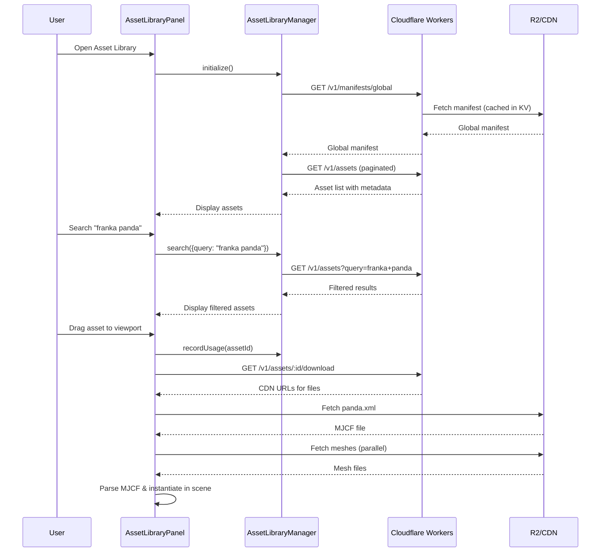
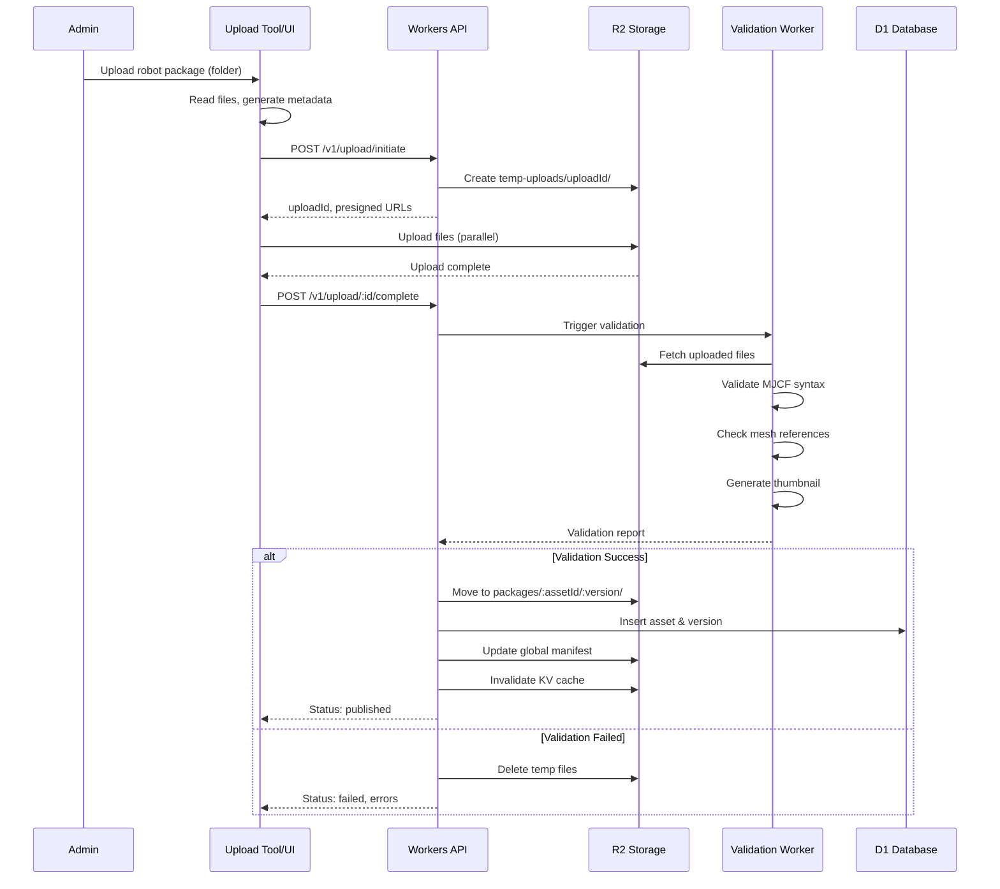
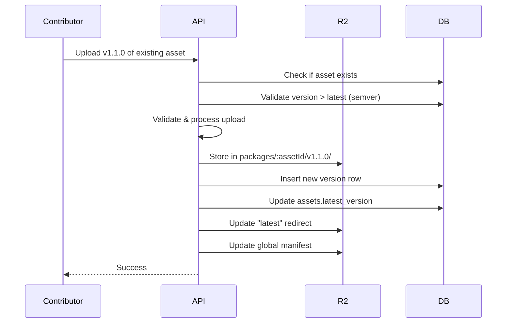
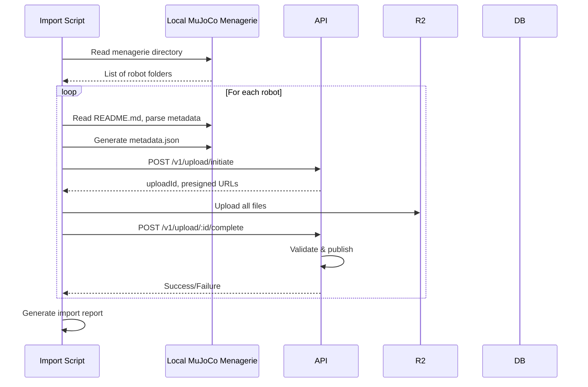

# Cloud Asset Storage & Library System - Technical Plan & Roadmap

**Feature Branch:** `feature/cloud-asset-library`
**Owner:** George
**Created:** 2025-10-08
**Status:** Planning Phase

---

## Executive Summary

This document outlines the comprehensive plan for implementing a cloud-based asset storage and delivery system for kinetiCORE, designed to host and serve industrial simulation assets (MJCF/URDF models, meshes, textures) from Cloudflare's global CDN.

**Goals:**
- Enable cloud storage of robot models from MuJoCo Menagerie and other sources
- Provide fast, global asset delivery via Cloudflare CDN
- Support versioning, metadata, and search across all assets
- Create robust workflows for upload, validation, and publishing
- Maintain backward compatibility with local asset loading

---

## Current State Analysis

### Existing Asset Library Implementation

**Files:**
- `src/library/AssetLibraryManager.ts` - Core manager (in-memory manifest loading)
- `src/library/AssetLoader.ts` - File loading utilities
- `src/ui/components/AssetLibrary/AssetLibraryPanel.tsx` - UI component
- `src/ui/store/assetLibraryStore.ts` - Zustand state management

**Current Capabilities:**
- ✅ In-memory manifest-based asset catalog
- ✅ Search and filtering by domain, class, manufacturer, tags
- ✅ Favorites and recent assets tracking
- ✅ Drag-and-drop asset instantiation
- ✅ LocalStorage persistence (favorites, recents)

**Current Limitations:**
- ❌ All assets must be bundled with app or served from `/public`
- ❌ No cloud storage integration
- ❌ No asset versioning or update mechanism
- ❌ No upload/publishing workflow
- ❌ No CDN optimization for global delivery
- ❌ No collaborative asset sharing

---

## MuJoCo Menagerie Storage Structure Analysis

### Asset Package Structure

Each robot model in MuJoCo Menagerie follows this pattern:

```
<robot_name>/
├── assets/                  # Mesh files (.obj, .stl)
│   ├── base_0.obj
│   ├── link1.stl
│   └── ...
├── <robot>.xml             # Main MJCF model definition
├── <robot>_mjx.xml         # MJX-compatible variant (optional)
├── scene.xml               # Scene with environment
├── scene_mjx.xml           # MJX scene variant (optional)
├── <robot>.png             # Preview thumbnail
├── README.md               # Documentation
├── CHANGELOG.md            # Version history
└── LICENSE                 # License file
```

### Key Observations

1. **Asset References:** MJCF XML files reference meshes via relative paths:
   ```xml
   <compiler meshdir="assets"/>
   <mesh name="link0_c" file="link0.stl"/>
   ```

2. **Multi-File Dependencies:** Each robot is a package with 10-100+ files
   - MJCF XMLs: 1-5 files
   - Meshes: 5-80 files (10KB - 4MB each)
   - Textures: 0-20 files (PNG/JPG)
   - Metadata: README, LICENSE, CHANGELOG

3. **File Sizes:**
   - Total package: 5MB - 50MB
   - Individual meshes: 10KB - 5MB
   - Scene files: 1-20KB

4. **Versioning:** Manual CHANGELOG.md tracking, no semantic versioning

5. **Metadata:** README contains:
   - DOF count, payload capacity, reach
   - Manufacturer, license
   - Build instructions, source attribution

---

## Cloud Architecture Design

### Technology Stack: Cloudflare Platform

**Recommended Cloudflare Services:**

| Service | Purpose | Pricing Tier |
|---------|---------|--------------|
| **R2 Storage** | Object storage for assets | Free: 10GB storage, 1M Class A ops/mo |
| **Workers** | API endpoints, validation | Free: 100K requests/day |
| **KV** | Manifest/metadata cache | Free: 100K reads/day, 1K writes/day |
| **D1** | Asset metadata database | Free: 5GB storage, 5M reads/day |
| **CDN** | Global asset delivery | Free with R2 |
| **Images** | Thumbnail optimization | Optional: $5/mo for 100K transforms |

**Why Cloudflare R2:**
- ✅ S3-compatible API (easy migration)
- ✅ Zero egress fees (critical for large mesh files)
- ✅ Global CDN automatically enabled
- ✅ Public bucket support for direct asset access
- ✅ Custom domains supported
- ✅ Generous free tier

### Storage Structure in R2

```
kineticore-assets/                   # R2 Bucket
├── manifests/
│   ├── global-manifest.json        # Global asset catalog
│   ├── manufacturing.json          # Domain-specific manifests
│   ├── medical.json
│   └── ...
├── packages/
│   ├── mujoco-menagerie/
│   │   ├── franka_emika_panda/
│   │   │   ├── v1.0.0/
│   │   │   │   ├── panda.xml
│   │   │   │   ├── scene.xml
│   │   │   │   ├── assets/
│   │   │   │   │   ├── link0.stl
│   │   │   │   │   └── ...
│   │   │   │   ├── metadata.json
│   │   │   │   └── thumbnail.png
│   │   │   ├── v1.1.0/
│   │   │   │   └── ...
│   │   │   └── latest -> v1.1.0/   # Symlink or redirect
│   │   ├── unitree_go2/
│   │   │   └── v1.0.0/
│   │   │       └── ...
│   │   └── ...
│   ├── custom-uploads/
│   │   ├── user_12345/
│   │   │   └── my_custom_robot/
│   │   │       └── v1.0.0/
│   │   │           └── ...
│   │   └── ...
│   └── shared-library/
│       ├── common-grippers/
│       │   └── ...
│       └── ...
├── thumbnails/                      # Pre-rendered thumbnails
│   ├── franka_panda_256x256.webp
│   └── ...
└── temp-uploads/                    # Staging area for validation
    └── upload_abc123/
        └── ...
```

### URL Structure

```
# Direct CDN access (public assets)
https://assets.kineticore.io/packages/mujoco-menagerie/franka_emika_panda/v1.0.0/panda.xml
https://assets.kineticore.io/packages/mujoco-menagerie/franka_emika_panda/latest/assets/link0.stl

# API endpoints (Workers)
https://api.kineticore.io/v1/assets/search?q=franka&domain=manufacturing
https://api.kineticore.io/v1/assets/franka_emika_panda
https://api.kineticore.io/v1/assets/franka_emika_panda/versions
https://api.kineticore.io/v1/upload/initiate
https://api.kineticore.io/v1/manifests/global

# Thumbnails (Cloudflare Images)
https://assets.kineticore.io/thumbnails/franka_panda/256x256.webp
```

---

## Data Models

### Asset Metadata Schema (metadata.json)

```typescript
interface AssetPackageMetadata {
  // Identity
  id: string;                        // "mujoco-menagerie/franka_emika_panda"
  version: string;                   // "1.1.0" (semantic versioning)
  name: string;                      // "Franka Emika Panda"

  // Classification
  domain: AssetDomain;               // "manufacturing"
  assetClass: AssetClass;            // "arm"
  assetType: string;                 // "collaborative_robot"

  // Metadata
  manufacturer: string;              // "Franka Robotics"
  description: string;
  license: {
    type: string;                    // "BSD-3-Clause"
    file: string;                    // "LICENSE"
  };

  // Capabilities
  capabilities: {
    dof: number;                     // 7
    payload: number;                 // kg
    reach: number;                   // mm
    hasKinematics: boolean;
    hasPhysics: boolean;
    hasVisuals: boolean;
    supportsMJX: boolean;
  };

  // Files
  files: {
    mainModel: string;               // "panda.xml"
    scene: string;                   // "scene.xml"
    thumbnail: string;               // "thumbnail.png"
    meshes: string[];                // ["assets/link0.stl", ...]
    textures: string[];
    documentation: string;           // "README.md"
  };

  // Package info
  packageSize: number;               // bytes
  uploadedAt: string;                // ISO 8601
  uploadedBy: string;                // user ID or "system"
  checksum: string;                  // SHA-256 of package

  // Search
  tags: string[];
  searchKeywords: string[];

  // Usage tracking
  downloadCount: number;
  usageCount: number;

  // Versioning
  changelog: string;                 // "CHANGELOG.md" or inline
  previousVersion?: string;          // "1.0.0"
}
```

### Global Manifest Schema (global-manifest.json)

```typescript
interface GlobalManifest {
  version: string;                   // Manifest schema version
  lastUpdated: string;               // ISO 8601

  // Asset index
  assets: {
    id: string;                      // "mujoco-menagerie/franka_emika_panda"
    latestVersion: string;           // "1.1.0"
    versions: string[];              // ["1.0.0", "1.1.0"]
    metadataUrl: string;             // URL to latest metadata.json
  }[];

  // Domain structure
  domains: {
    id: AssetDomain;
    name: string;
    assetCount: number;
    manifestPath: string;            // "manufacturing.json"
  }[];

  // Statistics
  stats: {
    totalAssets: number;
    totalPackages: number;
    totalSize: number;               // bytes
    manufacturers: string[];
  };
}
```

### D1 Database Schema (SQL)

```sql
-- Assets table
CREATE TABLE assets (
  id TEXT PRIMARY KEY,               -- "mujoco-menagerie/franka_emika_panda"
  name TEXT NOT NULL,
  domain TEXT NOT NULL,
  asset_class TEXT NOT NULL,
  manufacturer TEXT,
  latest_version TEXT NOT NULL,
  created_at DATETIME DEFAULT CURRENT_TIMESTAMP,
  updated_at DATETIME DEFAULT CURRENT_TIMESTAMP
);

-- Asset versions table
CREATE TABLE asset_versions (
  id INTEGER PRIMARY KEY AUTOINCREMENT,
  asset_id TEXT NOT NULL,
  version TEXT NOT NULL,             -- "1.1.0"
  r2_path TEXT NOT NULL,             -- "packages/.../v1.1.0/"
  metadata_json TEXT NOT NULL,       -- Full JSON metadata
  package_size INTEGER,
  checksum TEXT,
  uploaded_at DATETIME DEFAULT CURRENT_TIMESTAMP,
  uploaded_by TEXT,
  status TEXT DEFAULT 'active',      -- active | deprecated | archived
  FOREIGN KEY (asset_id) REFERENCES assets(id),
  UNIQUE(asset_id, version)
);

-- Usage tracking
CREATE TABLE asset_usage (
  id INTEGER PRIMARY KEY AUTOINCREMENT,
  asset_id TEXT NOT NULL,
  version TEXT,
  event_type TEXT NOT NULL,          -- download | view | instantiate
  user_id TEXT,
  timestamp DATETIME DEFAULT CURRENT_TIMESTAMP,
  FOREIGN KEY (asset_id) REFERENCES assets(id)
);

-- User favorites (optional)
CREATE TABLE user_favorites (
  user_id TEXT NOT NULL,
  asset_id TEXT NOT NULL,
  created_at DATETIME DEFAULT CURRENT_TIMESTAMP,
  PRIMARY KEY (user_id, asset_id),
  FOREIGN KEY (asset_id) REFERENCES assets(id)
);

-- Search index (FTS5)
CREATE VIRTUAL TABLE assets_search USING fts5(
  id,
  name,
  manufacturer,
  tags,
  keywords,
  description
);
```

---

## API Design (Cloudflare Workers)

### Endpoints

#### 1. Asset Discovery & Search

```typescript
// GET /v1/assets
// Search and filter assets
interface SearchAssetsRequest {
  query?: string;                    // Text search
  domain?: string[];                 // Filter by domain
  assetClass?: string[];
  manufacturer?: string[];
  tags?: string[];
  minDof?: number;
  maxDof?: number;
  sortBy?: 'name' | 'downloads' | 'updated';
  limit?: number;                    // Default: 50, max: 200
  offset?: number;
}

interface SearchAssetsResponse {
  assets: AssetSearchResult[];
  total: number;
  offset: number;
  limit: number;
}

// GET /v1/assets/:assetId
// Get asset details
interface GetAssetResponse {
  asset: AssetPackageMetadata;
  versions: {
    version: string;
    uploadedAt: string;
    size: number;
  }[];
  cdn_urls: {
    latest: string;
    versions: Record<string, string>;
  };
}

// GET /v1/manifests/global
// Get global manifest (cached in KV)
interface GetManifestResponse {
  manifest: GlobalManifest;
  cacheAge: number;                  // seconds
}
```

#### 2. Asset Download

```typescript
// GET /v1/assets/:assetId/download
// Get download URLs for asset package
interface DownloadAssetRequest {
  version?: string;                  // Default: "latest"
  format?: 'bundle' | 'individual'; // Bundle = .tar.gz, Individual = file list
}

interface DownloadAssetResponse {
  assetId: string;
  version: string;
  files: {
    path: string;                    // Relative path in package
    url: string;                     // CDN URL
    size: number;
    checksum: string;
  }[];
  bundleUrl?: string;                // .tar.gz download (optional)
  expiresAt: string;                 // Signed URL expiration
}
```

#### 3. Asset Upload (Admin/Contributor Workflow)

```typescript
// POST /v1/upload/initiate
// Initiate multi-part upload
interface InitiateUploadRequest {
  assetId: string;                   // "custom/my_robot"
  version: string;                   // "1.0.0"
  metadata: Partial<AssetPackageMetadata>;
}

interface InitiateUploadResponse {
  uploadId: string;                  // Unique upload session ID
  uploadUrls: Record<string, string>; // Presigned URLs for each file
  expiresAt: string;                 // Upload expiration
}

// POST /v1/upload/:uploadId/complete
// Complete upload and trigger validation
interface CompleteUploadRequest {
  uploadId: string;
  files: string[];                   // Uploaded file keys
}

interface CompleteUploadResponse {
  status: 'validating' | 'published' | 'failed';
  assetId: string;
  version: string;
  validationReport?: ValidationReport;
}

// GET /v1/upload/:uploadId/status
// Check validation status
interface UploadStatusResponse {
  uploadId: string;
  status: 'uploading' | 'validating' | 'published' | 'failed';
  progress: number;                  // 0-100
  errors?: string[];
  warnings?: string[];
}
```

#### 4. Versioning

```typescript
// GET /v1/assets/:assetId/versions
// List all versions of an asset
interface ListVersionsResponse {
  assetId: string;
  versions: {
    version: string;
    uploadedAt: string;
    status: 'active' | 'deprecated' | 'archived';
    downloadCount: number;
    changes?: string;                // Changelog entry
  }[];
}

// POST /v1/assets/:assetId/versions/:version/deprecate
// Mark version as deprecated (admin)
interface DeprecateVersionRequest {
  reason: string;
  replacedBy?: string;               // Version that replaces this one
}
```

---

## Workflows

### Workflow 1: User Browsing & Loading Assets



### Workflow 2: Asset Upload (Manual)



### Workflow 3: Asset Update/Versioning



### Workflow 4: Batch Import from MuJoCo Menagerie



---

## Implementation Roadmap

### Phase 1: Foundation (Week 1-2) 🏗️

**Goal:** Set up Cloudflare infrastructure and basic storage

**Tasks:**
1. Create Cloudflare account, provision services:
   - R2 bucket: `kineticore-assets`
   - D1 database: `kineticore-assets-db`
   - KV namespace: `kineticore-manifests`
   - Workers project: `kineticore-api`

2. Implement R2 storage structure:
   - Create folder hierarchy
   - Set up public bucket access
   - Configure custom domain: `assets.kineticore.io`

3. Database schema:
   - Create D1 tables (SQL schema above)
   - Set up FTS5 search index
   - Create database migrations system

4. Basic Worker API:
   - `GET /v1/manifests/global` - Serve cached manifest
   - `GET /v1/assets` - Basic asset listing
   - `GET /v1/assets/:id` - Asset details

**Deliverables:**
- ✅ Cloudflare infrastructure provisioned
- ✅ Empty R2 bucket with structure
- ✅ D1 database with schema
- ✅ Basic API responding to requests
- ✅ Custom domain configured

---

### Phase 2: Asset Ingestion (Week 3-4) 📦

**Goal:** Import MuJoCo Menagerie assets to cloud storage

**Tasks:**
1. Create import script (Node.js):
   - Parse MuJoCo Menagerie folder structure
   - Extract metadata from README files
   - Generate `metadata.json` for each robot
   - Upload files to R2 (batch operation)

2. Metadata extraction:
   - Parse DOF, payload, reach from README
   - Extract license from LICENSE file
   - Generate thumbnails (ImageMagick or Cloudflare Images)
   - Calculate package checksums

3. Validation system:
   - MJCF XML syntax validation (MuJoCo parser)
   - Check mesh file references
   - Verify file sizes and types
   - Generate validation reports

4. Manifest generation:
   - Build global manifest from uploaded assets
   - Generate domain-specific manifests
   - Cache manifests in KV
   - Store metadata in D1

**Deliverables:**
- ✅ Import script for MuJoCo Menagerie
- ✅ 50+ robots uploaded to R2
- ✅ Generated manifests in KV
- ✅ D1 database populated
- ✅ Validation reports for each asset

---

### Phase 3: Client Integration (Week 5-6) 🔌

**Goal:** Update kinetiCORE client to load assets from cloud

**Tasks:**
1. Update `AssetLibraryManager.ts`:
   - Replace local manifest loading with API calls
   - Implement manifest caching (IndexedDB)
   - Add asset download orchestration
   - Handle version selection

2. New `CloudAssetLoader.ts`:
   ```typescript
   class CloudAssetLoader {
     async downloadAsset(assetId: string, version?: string): Promise<AssetPackage>
     async downloadFile(url: string): Promise<ArrayBuffer>
     async downloadAndParseXML(url: string): Promise<Document>
     async loadMeshes(urls: string[]): Promise<Mesh[]>
     getCachedAsset(assetId: string): AssetPackage | null
     cacheAsset(assetId: string, asset: AssetPackage): void
   }
   ```

3. Implement asset caching:
   - Use IndexedDB for asset storage
   - Cache manifests, metadata, and files
   - LRU eviction for large assets
   - Background sync for updates

4. Update MJCF/URDF loaders:
   - Support remote mesh URLs in `<compiler meshdir="..."/>`
   - Resolve relative paths to CDN URLs
   - Parallel mesh loading with progress tracking
   - Fallback to local assets if CDN unavailable

5. UI updates:
   - Show download progress for large assets
   - Display asset version in UI
   - Add "Check for updates" button
   - Show cloud vs. local asset badges

**Deliverables:**
- ✅ `CloudAssetLoader` implementation
- ✅ IndexedDB caching system
- ✅ Updated `AssetLibraryManager`
- ✅ MJCF/URDF loaders support remote meshes
- ✅ UI shows cloud asset status

---

### Phase 4: Upload & Versioning (Week 7-8) ⬆️

**Goal:** Enable asset upload and versioning workflows

**Tasks:**
1. Upload API endpoints:
   - `POST /v1/upload/initiate` - Generate presigned URLs
   - `POST /v1/upload/:id/complete` - Finalize upload
   - `GET /v1/upload/:id/status` - Check validation status

2. Validation Worker:
   - Queue-based validation system (Cloudflare Queues)
   - MJCF syntax validation
   - Mesh reference checking
   - Thumbnail generation
   - Security scanning (file types, sizes)

3. Web UI for asset upload:
   - Drag-and-drop folder upload
   - Metadata form (name, manufacturer, DOF, etc.)
   - Upload progress indicator
   - Validation results display
   - Publish button

4. Versioning system:
   - Semantic versioning enforcement
   - Changelog editor
   - Version comparison UI
   - Deprecation workflow
   - "latest" redirect management

5. CLI upload tool:
   ```bash
   kineticore-cli upload ./my_robot/ \
     --id "custom/my_robot" \
     --version "1.0.0" \
     --domain "manufacturing"
   ```

**Deliverables:**
- ✅ Upload API endpoints
- ✅ Validation Worker with queue
- ✅ Web upload UI
- ✅ Versioning system
- ✅ CLI upload tool

---

### Phase 5: Advanced Features (Week 9-10) 🚀

**Goal:** Add collaborative and optimization features

**Tasks:**
1. User authentication (optional):
   - Cloudflare Access for admin panel
   - API key system for uploads
   - User-specific namespaces (`user_123/my_robot`)

2. Advanced search:
   - Full-text search with FTS5
   - Filter by capabilities (DOF range, payload, reach)
   - Tag-based discovery
   - Manufacturer filtering
   - Usage-based recommendations

3. Asset analytics:
   - Download counts
   - Usage tracking (instantiate events)
   - Popular assets dashboard
   - Regional CDN performance

4. Optimization:
   - Mesh compression (Draco)
   - Texture optimization (WebP, mipmaps)
   - Lazy loading for large packages
   - Streaming asset delivery

5. Collaboration features:
   - Asset comments and ratings
   - Fork/derivative tracking
   - License compliance checking
   - Attribution display

**Deliverables:**
- ✅ User authentication system
- ✅ Advanced search with FTS5
- ✅ Analytics dashboard
- ✅ Mesh compression pipeline
- ✅ Collaboration features

---

### Phase 6: Production Hardening (Week 11-12) 🔒

**Goal:** Prepare for production deployment

**Tasks:**
1. Performance optimization:
   - CDN cache headers (1 year for immutable files)
   - Manifest caching strategy (5 min TTL)
   - R2 request batching
   - Worker request coalescing

2. Monitoring & logging:
   - Cloudflare Analytics integration
   - Error tracking (Sentry)
   - Performance monitoring
   - Usage dashboards

3. Security:
   - Rate limiting (Cloudflare Rate Limiting)
   - DDoS protection
   - Input validation and sanitization
   - Malware scanning for uploads

4. Documentation:
   - API documentation (OpenAPI spec)
   - Asset upload guide
   - Integration guide for developers
   - Versioning best practices

5. Testing:
   - Unit tests for Workers
   - Integration tests for API
   - Load testing (k6)
   - Failover testing

6. Backup & disaster recovery:
   - R2 bucket replication
   - D1 backups
   - Manifest snapshots
   - Recovery procedures

**Deliverables:**
- ✅ Production-ready API
- ✅ Monitoring & alerting
- ✅ Security hardening
- ✅ Complete documentation
- ✅ Backup/recovery plan
- ✅ Load testing results

---

## Cost Estimation

### Cloudflare Free Tier (Monthly)

| Service | Free Tier | Expected Usage | Over Limit Cost |
|---------|-----------|----------------|-----------------|
| R2 Storage | 10 GB | ~5 GB (50 robots @ 100MB avg) | $0.015/GB/mo |
| R2 Class A Ops | 1M/mo | ~50K/mo (manifest updates, uploads) | $4.50/M ops |
| R2 Class B Ops | 10M/mo | ~500K/mo (asset downloads) | $0.36/M ops |
| Workers | 100K req/day | ~10K req/day (asset searches) | $0.50/M req |
| KV Reads | 100K/day | ~5K/day (manifest cache) | $0.50/M reads |
| KV Writes | 1K/day | ~100/day (manifest updates) | $5.00/M writes |
| D1 Storage | 5 GB | ~100 MB (metadata) | $0.75/GB |
| D1 Reads | 5M/day | ~100K/day (search queries) | $0.001/1K reads |

**Total Monthly Cost (within free tier):** $0
**Projected Cost at 10x scale:** ~$5-10/month

### Storage Breakdown (50 MuJoCo Menagerie Robots)

- MJCF files: 50 × 50KB = 2.5 MB
- Meshes: 50 × 20MB = 1 GB
- Textures: 50 × 5MB = 250 MB
- Thumbnails: 50 × 50KB = 2.5 MB
- Metadata: 50 × 10KB = 500 KB
- **Total:** ~1.3 GB (well within 10 GB free tier)

---

## Migration Strategy

### Backward Compatibility

**Support both local and cloud assets:**

```typescript
// AssetLoader.ts
interface AssetSource {
  type: 'local' | 'cloud';
  priority: number;
}

class HybridAssetLoader {
  async loadAsset(assetId: string): Promise<AssetPackage> {
    // 1. Check IndexedDB cache
    const cached = await this.cache.get(assetId);
    if (cached && !this.isStale(cached)) return cached;

    // 2. Try cloud CDN
    try {
      const cloudAsset = await this.cloudLoader.download(assetId);
      await this.cache.set(assetId, cloudAsset);
      return cloudAsset;
    } catch (error) {
      console.warn('Cloud load failed, falling back to local', error);
    }

    // 3. Fallback to local bundle
    return await this.localLoader.load(assetId);
  }
}
```

**Gradual rollout:**
1. Week 1-2: Deploy cloud infrastructure, populate assets
2. Week 3: Enable cloud loading behind feature flag
3. Week 4: Beta test with 10% of users
4. Week 5: Gradual rollout to 100%
5. Week 6: Remove local asset bundle from build (reduce bundle size)

---

## Risk Mitigation

### Risk 1: CDN Downtime
- **Mitigation:** Cache assets in IndexedDB, fallback to local bundle
- **Recovery:** Multi-region R2 replication (paid feature)

### Risk 2: Large Asset Download Times
- **Mitigation:** Progressive loading, streaming meshes, compression
- **Metrics:** Monitor P95 load times, optimize slow assets

### Risk 3: Version Conflicts
- **Mitigation:** Semantic versioning, deprecation warnings, migration guides
- **Testing:** Version compatibility test suite

### Risk 4: Malicious Uploads
- **Mitigation:** Validation worker, file type whitelist, size limits
- **Security:** Cloudflare WAF, malware scanning, content moderation

### Risk 5: Bandwidth Costs
- **Mitigation:** R2 has zero egress fees, aggressive caching
- **Monitoring:** Track bandwidth usage, alert on anomalies

---

## Success Metrics

### Technical Metrics
- Asset load time: <2s P95 (from cache), <10s P95 (cold load)
- Search latency: <200ms P95
- Upload success rate: >95%
- CDN cache hit rate: >90%
- API availability: >99.9%

### Business Metrics
- Total assets in library: 100+ (Phase 1)
- Active users: 50+ using cloud assets
- Asset downloads: 1000+/month
- User-uploaded assets: 10+ (Phase 2)

### User Experience
- Asset discovery: <30s to find desired robot
- Upload workflow: <5 min for typical robot
- Versioning: Zero breaking changes for users

---

## Next Steps

### Immediate Actions (This Week)
1. ✅ Create Cloudflare account
2. ✅ Provision R2 bucket, D1 database, KV namespace
3. ✅ Set up Workers project with Wrangler CLI
4. ✅ Write initial Worker for `GET /v1/manifests/global`
5. ✅ Create D1 schema and migrations

### Week 2 Actions
1. ⏳ Implement basic import script for MuJoCo Menagerie
2. ⏳ Upload 5 test robots to R2
3. ⏳ Generate test manifest
4. ⏳ Test CDN asset delivery
5. ⏳ Begin client integration (AssetLibraryManager updates)

---

## References

### Technical Documentation
- [Cloudflare R2 Docs](https://developers.cloudflare.com/r2/)
- [Cloudflare Workers Docs](https://developers.cloudflare.com/workers/)
- [Cloudflare D1 Docs](https://developers.cloudflare.com/d1/)
- [MuJoCo MJCF Reference](https://mujoco.readthedocs.io/en/stable/XMLreference.html)
- [MuJoCo Menagerie](https://github.com/google-deepmind/mujoco_menagerie)

### Related kinetiCORE Docs
- `COORDINATE_SYSTEM.md` - Z-up coordinate standard
- `docs/architecture.md` - Overall architecture
- `src/library/types.ts` - Asset type definitions
- `CLAUDE.md` - Project context and conventions

---

**Document Status:** Draft v1.0
**Last Updated:** 2025-10-08
**Next Review:** After Phase 1 completion
